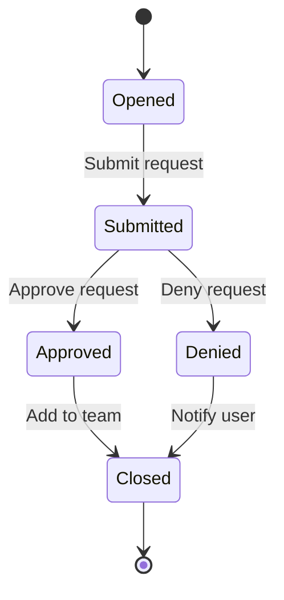

export { Layout as default } from '@issue-ops/gatsby-theme-doctocat-typescript'
import { Note } from '@issue-ops/gatsby-theme-doctocat-typescript'
import { BookIcon, PersonIcon } from '@primer/octicons-react'
import { Avatar, Box, StateLabel, Timeline } from '@primer/react'
import { Blankslate } from '@primer/react/drafts'

## Issues and pull requests

In GitHub, a pull request (PR) can be interacted with in a lot of the same ways
as an issue. For example, the
[List repository issues](https://docs.github.com/en/free-pro-team@latest/rest/issues/issues?apiVersion=2022-11-28#list-repository-issues)
REST API will return both issues and PRs for a repository.

This means that many of the features of an issue are applicable to a PR.
However, PRs have some extra functionality that can also be used in an IssueOps
workflow. Depending on the use-case, you might want to select one over the
other. For example, if you want to use the review and approval functionality for
changes to repository contents, you'll need to use a PR. If you want to use the
[issue forms](https://docs.github.com/en/communities/using-templates-to-encourage-useful-issues-and-pull-requests/syntax-for-issue-forms)
feature, you'll need to use an issue.

For more information on their structure and usage in IssueOps, see
[Issues and PRs](/introduction/issues-and-prs).

## IssueOps concept

Think of IssueOps as a
[state diagram](https://en.wikipedia.org/wiki/State_diagram). An issue is the
_object_ that changes state in response to specific _events_. As the object
changes state, certain _actions_ may be performed as part of the _transition_
(provided any _guard_ conditions are met). Once an _end state_ is reached, the
issue is considered complete and can be closed.

### State Diagrams

The following sections contain definitions and examples of common terms used in
state diagrams. These terms are used throughout this documentation.

#### Action

An atomic task that is performed when a transition is taken.

<Blankslate>
  <Blankslate.Visual>
    <Avatar
      src="https://avatars.githubusercontent.com/u/92997159?v=4"
      size={80}
    />
  </Blankslate.Visual>
  <Blankslate.Heading>@mona has invited you to collaborate</Blankslate.Heading>
</Blankslate>

#### Event

An external occurrence that triggers a state change.

<Timeline>
  <Timeline.Item>
    <Timeline.Badge>
      <PersonIcon size={16} />
    </Timeline.Badge>
    <Timeline.Body>@octocat self-assigned this</Timeline.Body>
  </Timeline.Item>
</Timeline>

#### Guard

A condition that is evaluated when a trigger event occurs. A transition is taken
only if all associated guard conditions are met.

#### State

A point in an object's lifecycle that satisfies certain condition(s).

<Box style={{ alignItems: 'center', textAlign: 'center' }}>
  <StateLabel status="issueOpened">Open</StateLabel>
</Box>

#### Transition

A link between two states that, when traversed by an object, will cause certain
action(s) to be performed.

## IssueOps workflow

In general, an IssueOps workflow will follow the same basic pattern:

1. A user opens an issue and provides information about a request
1. The issue is validated to ensure it contains the required information
1. (Optional) Approval is requested from an authorized user or team
1. The request is processed and the issue is closed

Let's use a more practical example...

### Example: GitHub team membership

_**User Story:**_ As a developer, I should be able to request membership to
various teams and, if approved by administrators, be granted membership.

Suppose you are an admin of an organization and would like to reduce the
overhead of managing team membership. You can use IssueOps to build an automated
membership request and approval process.

We can assume the current, manual workflow looks something like this when
rendered as a state diagram.

<Note>
  In state diagram format, nodes represent the state of an object (the
  membership request), while transitions represent actions that are taken as the
  object changes state.
</Note>

<Box style={{ alignItems: 'center', textAlign: 'center' }}>

</Box>

When creating an IssueOps workflow, you can use this diagram as a starting point
to determine what events should trigger state changes, how to represent those
events in issues, and what actions to take in response to state changes.

## Event triggers

In the membership request workflow, there are several events that trigger a
change in the request state:

- A user submits a request
- An admin approves a request
- An admin denies a request
- A user is added to a team
- A user is notified

In GitHub, there are many ways to trigger events. For a full list, see
[Events that trigger workflows](https://docs.github.com/en/actions/using-workflows/events-that-trigger-workflows).
Here, we will focus on the events that are most relevant to IssueOps.

### Issues

Events related to issues seem like a good fit for <i>Issue</i>Ops :wink: Issues
are the entrypoint to the worflow. In particular, the issue being _opened_. You
can think of this as someone coming to you and saying "Can you add me to this
team?" Until this event occurs, there's nothing to do!

However, this is not the only issue event that can be used in a workflow. The
following table lists other
[issue events](https://docs.github.com/en/actions/using-workflows/events-that-trigger-workflows#issues)
and example use-cases.

| Event          | Example                                                                                                                         |
| -------------- | ------------------------------------------------------------------------------------------------------------------------------- |
| `opened`       | Start a request workflow                                                                                                        |
| `edited`       | Re-validate a modified request                                                                                                  |
| `deleted`      | Cancel in-flight tasks for a request                                                                                            |
| `transferred`  | Assign ownership of a request to a different department                                                                         |
| `pinned`       | Upgrade the severity/urgency of a request                                                                                       |
| `unpinned`     | Downgrade the severity/urgency of a request                                                                                     |
| `closed`       | End a request workflow                                                                                                          |
| `reopened`     | Restart a request workflow                                                                                                      |
| `assigned`     | Ping the assignee in Slack                                                                                                      |
| `unassigned`   | Ping the previous assignee in Slack                                                                                             |
| `labeled`      | Track the current state of a request                                                                                            |
| `unlabeled`    | Track the current state of a request                                                                                            |
| `locked`       | See [locking conversations](https://docs.github.com/en/communities/moderating-comments-and-conversations/locking-conversations) |
| `unlocked`     | See [locking conversations](https://docs.github.com/en/communities/moderating-comments-and-conversations/locking-conversations) |
| `milestoned`   | Track requests by type to compare to team goals                                                                                 |
| `demilestoned` | Track requests by type to compare to team goals                                                                                 |

<Note variant="danger">
  [Access to delete
  issues](https://docs.github.com/en/organizations/managing-organization-settings/allowing-people-to-delete-issues-in-your-organization)
  should be carefully controlled. If you delete an issue, you will lose all of
  the information associated with it, including comments and attachments. You
  will also lose this request in the history of the repository.
</Note>

### Issue comments

After an issue is opened, other events must take place that change the state and
drive it through the workflow. In the membership request workflow, for example,
commenting on an issue is a great way to handle state changes such as an
administrator approving or denying the request.

<Note>
  A core difference between issues and PRs is that issues do not have a built-in
  approval process. However, this can be implemented using issue comments. For
  more information, see [Approvals](/workflow/approvals).
</Note>

Currently there are only three
[`issue_comment` events](https://docs.github.com/en/actions/using-workflows/events-that-trigger-workflows#issue_comment)
that can trigger workflows:

- `created`
- `edited`
- `deleted`

In all three cases, the _context_ of the comment should be taken into account to
determine how to transition the request state. For example, if only authorized
administrators are allowed to approve team membership requests, how should an
IssueOps workflow react if someone else comments with approval?

All GitHub Actions workflow runs include important
[context information](https://docs.github.com/en/actions/learn-github-actions/contexts)
that can be accessed by your workflow. The
[`issue_comment` context](https://docs.github.com/en/webhooks/webhook-events-and-payloads#issue_comment)
can provide us with information to decide what actions to take, if any. In our
team membership workflow, we can get the user that created the comment using the
`github.event.comment.user.login` property. We can then use this to determine if
the user is authorized to approve the request.

### Labels

Labels are a great way to track the state of a request. You can think of these
as the nodes in a state diagram, while the transitions are the actions that are
taken as the request changes state. You can also use labels to classify the
types of requests when your repository supports more than one IssueOps workflow.
For example, in the membership request workflow, you might have the following
labels:

| Label                     | Description                                              |
| ------------------------- | -------------------------------------------------------- |
| `team-membership-request` | The type of request                                      |
| `submitted`               | Requests that have been submitted and are pending review |

Looking at this list, you may ask "why there aren't labels for `approved`,
`denied`, or `closed` states?" These states don't have any transitions that do
not lead to the issue being closed. In other words, once a request is approved
or denied, the issue will **always** reach the `closed` state, regardless of
whether it was approved or denied. If this workflow had more steps, such as
requiring multiple approvals, additional states would need to be tracked.

As with `issue_comment` events, there are only three
[`label` events](https://docs.github.com/en/actions/using-workflows/events-that-trigger-workflows#label)
available:

- `created`
- `edited`
- `deleted`

These, however, refer to the actual creation and modification of the label
itself, so they may not apply to your workflow. You will generally use the
`issue => labeled` event instead.

<Note variant="warning">
  Anyone with access to open issues can also change labels! Labels are good for
  state tracking, but should not be used to determine if a request is valid! For
  more information, see the [Validate](/workflow/validate) step.
</Note>

## GitHub features

You can leverage other GitHub features to dramatically increase the value of
IssueOps.

### Secrets

[Secrets](https://docs.github.com/en/actions/security-guides/using-secrets-in-github-actions)
let you store sensitive information at the organization, repository, or
environment level to share with GitHub Actions workflows. You can use secrets to
store information such as API keys, passwords, or tokens. Secrets are encrypted
and only exposed to runners at runtime. You can use secrets to store information
such as API keys, passwords, or tokens that can be used to access external
resources from your workflows.

### Projects and milestones

Keeping track of requests, especially when you have an approval process in
place, is important.
[Projects](https://docs.github.com/en/issues/planning-and-tracking-with-projects/learning-about-projects/about-projects)
make it easy to track requests throughout their lifecycle. You can automatically
add issues as they are opened, and use lifecycle rules to keep track of the
state of requests without having to manually move them around your project
board.

You can also combine this with
[Milestones](https://docs.github.com/en/issues/using-labels-and-milestones-to-track-work/about-milestones)
to better organize issues and PRs. For example, if your IssueOps repository
includes workflows for multiple types of requests, you can add issues for each
request type to a corresponding milestone. That way they are automatically
categorized in your project.

[Project insights](https://docs.github.com/en/issues/planning-and-tracking-with-projects/viewing-insights-from-your-project)
give you a visual snapshot of how requests are being processed. You can create
custom graphs of to see when and how teams are using your workflows.

### GitHub Apps

One of the most important things to consider when creating workflows that
interact with the GitHub APIs is permissions. GitHub Actions workflows can only
interact with the repository in which they run. For example, the default
permissions do not allow GitHub Actions to manage team membership. If you are
building a workflow that interacts with resources outside of the repository it
is running in, you should consider creating an organization-level
[GitHub App](https://docs.github.com/en/apps/overview) and installing it in your
IssueOps repository. That way, you can use the permissions of the app to
interact with other resources in your organization.

For more information, see [GitHub App](/setup/github-app) in the setup
documentation.
