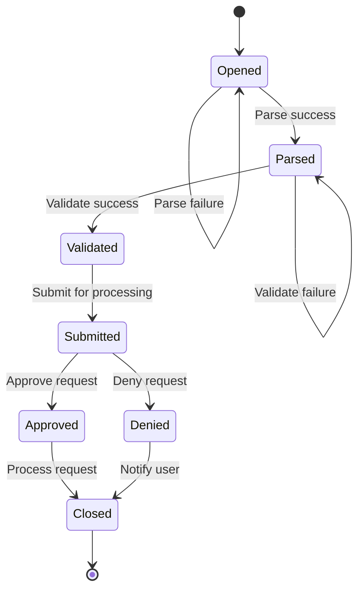
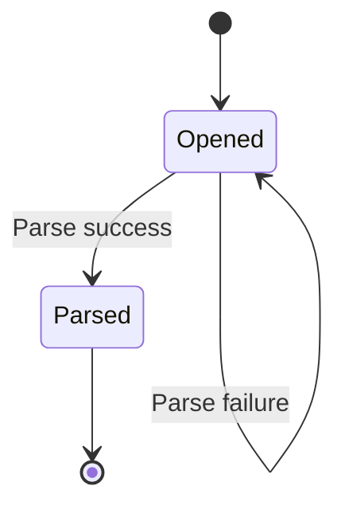

export { Layout as default } from '@issue-ops/gatsby-theme-doctocat-typescript'
import { ImageContainer } from '@issue-ops/gatsby-theme-doctocat-typescript'
import { Box } from '@primer/react'

As the [introduction](/introduction) mentioned, IssueOps can be thought of as a
state diagram where an issue transitions through different states in response to
events and conditions. This section of the documentation describes some common
states, transitions. and how to implement them in your workflows.

## States

_If an issue was a paper form, a state would be a big rubber stamp that tells
anyone who looks at the form exactly what is going on._

Tracking state can be as simple as checking what labels are applied to your
issues. Whatever approach you want to take, remember that tracking state is
critical to ensure that the right processing occurs at the right time!

| State       | Description                                                                             |
| ----------- | --------------------------------------------------------------------------------------- |
| `Opened`    | The initial state for a new issue that has been opened.                                 |
|             | Typically the first state in the lifecycle of an issue.                                 |
| `Parsed`    | The issue body has been read and converted to machine-readable JSON                     |
|             | Usually the next immediate state after `Opened`.                                        |
| `Validated` | The issue body has been deemed valid based on any custom rules.                         |
|             | Usually the next immediate state after `Parsed`.                                        |
|             | The next transitions depend on the type of request and any rules that must be followed. |
| `Submitted` | The issue has been submitted for processing                                             |
| `Approved`  | The issue has been approved for processing.                                             |
| `Denied`    | The issue has been denied for processing                                                |
| `Closed`    | The issue has been closed :tada:                                                        |

<Box style={{ alignItems: 'center', textAlign: 'center' }}>



</Box>

## Transitions

_If an issue was a paper form, a transition would be someone taking it out of
their inbox, stamping it **APPROVED**, and putting it in their outbox._

Transitions are where actual processing on your issues occurs. A transition is
equivalent to an event that triggers a GitHub Actions workflow run. That is why,
as your IssueOps workflows become larger and more complex, tracking state is so
important. Otherwise, its easy to end up the wrong workflows running at the
wrong time!

Since each transition is triggered by the same type of event:

```yaml
on:
  issue_comment:
    - created
```

Your workflows must track the following to determine what jobs to run:

- Issue state
- Issue body
- Comment body (command and arguments)
- Any other relevant information in the issue

Each of the following sections describes how to implement the core transitions
in an IssueOps workflow. Throughout each page, you will see an example
implementation of a new repository request workflow. This workflow is designed
to demonstrate how to apply each concept.

{/* TODO: The full example can be found in the [`issue-ops/new-repository-example`](https://github.com/issue-ops/new-repository-example) repository. */}

- [Parse](/states-and-transitions/parse)
- [Validate](/states-and-transitions/validate)
- [Submit](/states-and-transitions/submit)
- [Approve](/states-and-transitions/approve)
- [Deny](/states-and-transitions/deny)

## FAQ

### Do my IssueOps need all these states?

Nope! You can use as many or as few states as you need. For example, if you
don't need an authorized user to approve requests, you can omit the `Approved`
state.

### Can my IssueOps use each state more than once?

Of course! In state diagrams, its common for each state to have multiple
transitions. States can even transition back into themselves!

When an issue is first opened it will be in the `Opened` state. Typically, the
first step after an issue is opened is to parse the body and prepare for further
processing. If this is successful, the issue would transition into the `Parsed`
state. If there is a problem during parsing, the workflow can add a comment with
a descriptive error and return the issue to the `Opened` state. When the user
edits the issue to fix the error, parsing would run again.

<Box style={{ alignItems: 'center', textAlign: 'center' }}>



</Box>
