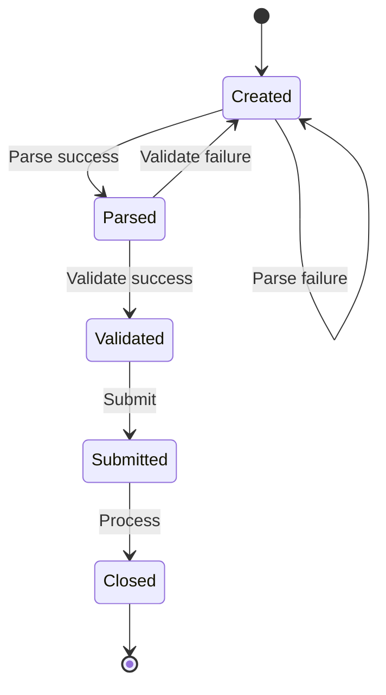

export { Layout as default } from '@issue-ops/gatsby-theme-doctocat-typescript'
import { Box } from '@primer/react'

As the [introduction](/introduction) mentioned, IssueOps can be thought of as a
state diagram where an issue moves through different states in response to
events and conditions. This section of the documentation describes some common
states and how to implement various transitions.

## States

| State                          | Description                                            |
| ------------------------------ | ------------------------------------------------------ |
| [Created](/states/created)     | The issue has been opened                              |
| [Parsed](/states/parsed)       | The issue has been parsed into a structured format     |
| [Validated](/states/validated) | The issue has been validated against your requirements |
| [Submitted](/states/submitted) | The issue has been submitted for processing            |
| [Approved](/states/approved)   | The issue has been approved for processing             |
| [Closed](/states/closed)       | The issue has been closed                              |

### Do my IssueOps need all these states?

No! You can use as many or as few states as you need. For example, if you don't
need an authorized user to approve requests, you can omit the `Approved` state.

### Can my IssueOps use each state more than once?

Yes! In state diagrams, its common for each state to have multiple transitions.
States can even transition back into themselves! For example, when an issue is
first opened it will be in the `Created` state. Your IssueOps workflows can
attempt to parse the issue and, if successful, move it into the `Parsed` state.
However, if there is a problem, the workflow can add a comment with a
descriptive error and the issue will return to the `Created` state until the
user edits the issue to fix the error(s).

<Box style={{ alignItems: 'center', textAlign: 'center' }}>

</Box>
